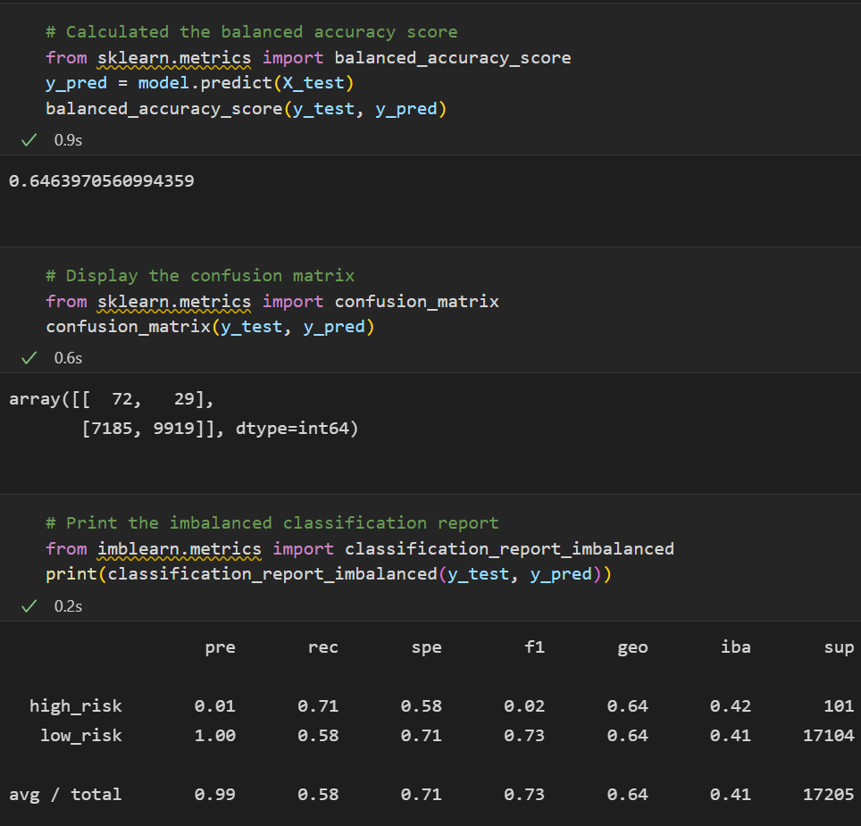
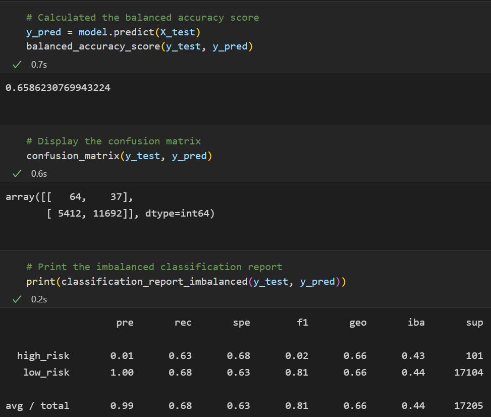
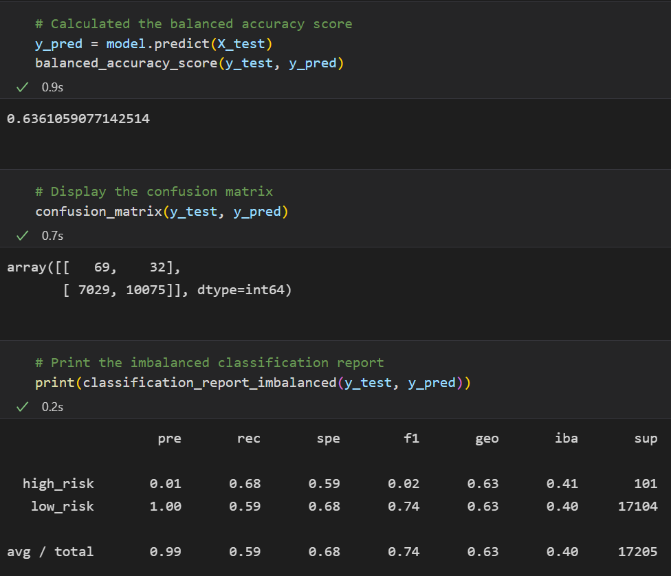
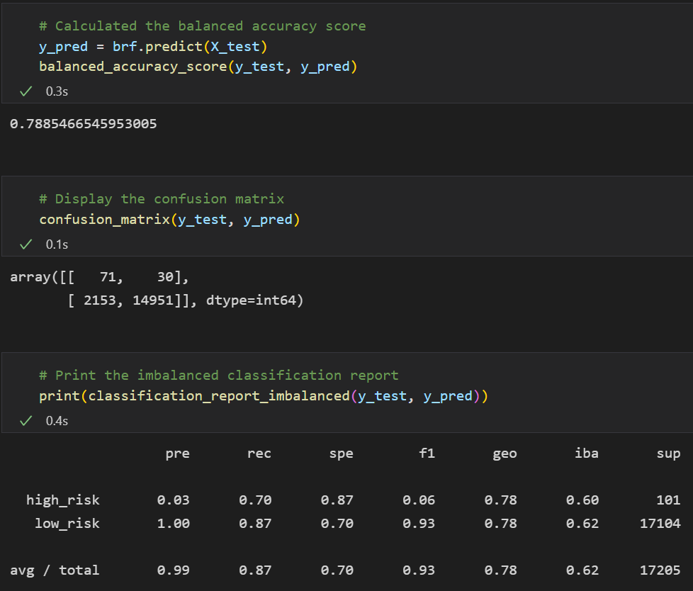
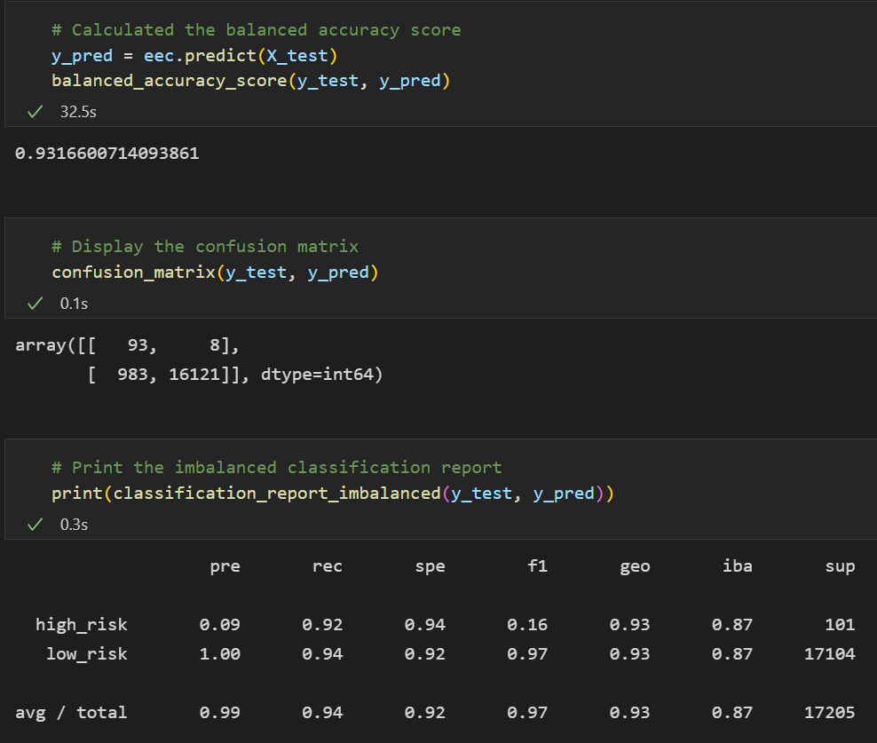

# Credit_Risk_Analysis
Machine learning, sklearn, imblearn, statistics

# Overview of the analysis
The purpose of this analysis is to use the credit card credit dataset from LendingClub to oversample the data using RandomOverSampler and SMOTE algorithms, and undersample the data using the ClusterCentroids algorithm. Then we'll use a combinatorial approach of over and under sampling using the SMOTEENN algorithm. Then we'll compare two new models that reduce bias, BalancedRandomForestClassifier and EasyEnsembleClassifier, to predict credit risk.

# Results
## **Naive Random Oversampling**
* Balanced Accuracy Score: 0.65 (65%)
* Precision: 0.01 (1%)
* Recall: 0.71 (71%)
* F1: 0.02 (2%)

## **SMOTE Oversampling**
* Balanced Accuracy Score: 0.66 (66%)
* Precision: 0.01 (1%)
* Recall: 0.63 (63%)
* F1: 0.02 (2%)

## **ClusterCentroids Undersampling**
* Balanced Accuracy Score: 0.54 (54%)
* Precision: 0.01 (1%)
* Recall: 0.69 (69%)
* F1: 0.01 (1%)

## **Over and Under sampling with SMOTEENN**
* Balanced Accuracy Score: 0.64 (64%)
* Precision: 0.01 (1%)
* Recall: 0.68 (68%) 
* F1: 0.02 (2%)

## **Balanced Random Forest Classifier**
* Balanced Accuracy Score: 0.79 (79%)
* Precision: 0.03 (3%)
* Recall: 0.70 (70%)
* F1: 0.06 (6%)

## **Easy Ensemble Classifier**
* Balanced Accuracy Score: 0.93 (93%)
* Precision: 0.09 (9%)
* Recall: 0.92 (92%)
* F1: 0.16 (16%)

## Summary
Of the six models that we tested, the following statements are true:
* Five out of six models had a Balanced accuracy score below 80%, which indicates poor performance among the models. The EasyEnsembleClassifier performed best with a 93% balanced accuracy score.
* None of the models reached a precision score higher than 10%, which is exceptionally poor for credit risk checking. 
* Five out of six models had recall scores below 72%, which is unacceptable for credit risk checking. The EasyEnsembleClassifier performed best with 92% recall score.
* Four out of six models had F1 scores at 2% or less. The other two models (BRFC and EEC) had F1 scores of 6% and 16%, respectively.

It is my recommendation that none of these models be used in actual real-world situations for those being evaluated for a loan. The best performing model, EEC, appears to do very well with it's accuracy score of 93%, and recall score of 92%, however, the low precision score of 9% would mean that this model would be wrong a vast majority of the time when predicting a high risk case. 